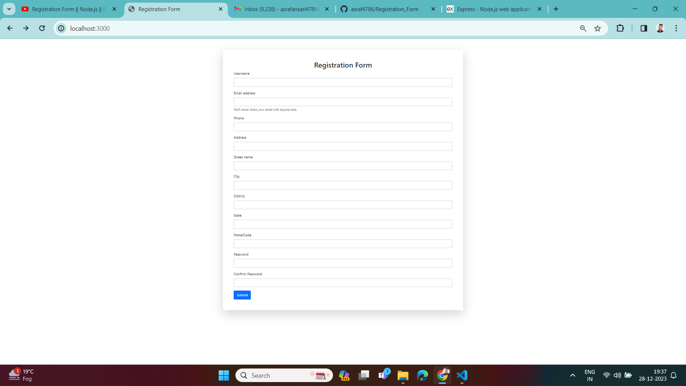

# NodeJS-REGISTRATION-FORM

# Deployment-link

https://asraf4786.github.io/Registration_Form/

<h1 align="center">Using Tools  📝</h1> 

 
     This App built using <a href="https://www.mongodb.com/">MongoDB</a>, <a href="https://expressjs.com/">ExpressJs</a>, <a href="https://nodejs.org/en/">NodeJs</a> and <a 

## Features

- Registration Form

## Screenshots

- Registration Form
  

## Setup

Run `npm install` to install required dependencies

Environment Variables:

- PORT = [Your Port]

- MONGO_URI = [Your MongoDB Ur]
